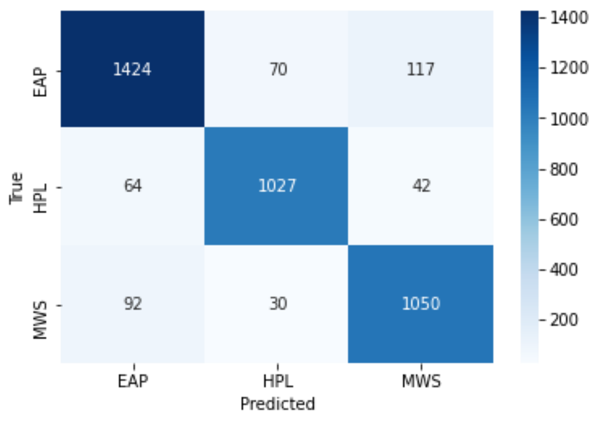

# author_detection
tf_idf f1_score for EAP,HPL,MWS is 0.81436077 0.79338843 0.80341113
Confusion matrix for this model:

**BERT encodings with BERT classifier:**
f1_score for EAP,HPL,MWS is 0.89251018 0.90884956 0.88198236
Confusion matrix for this model:

